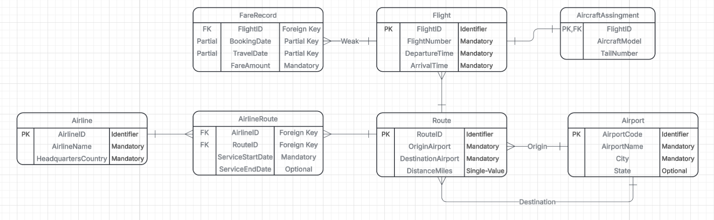
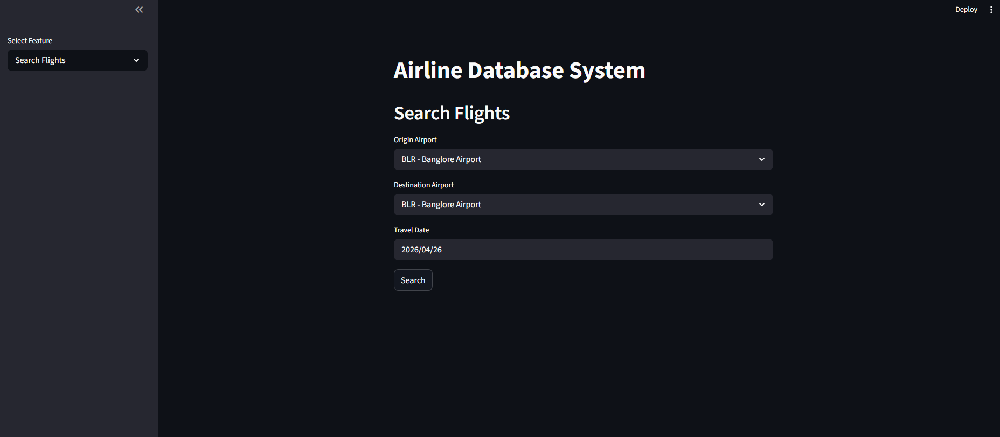

# cop-3710_Airline_Ticket_Pricing_Intelligence_Database

Application Domain:
The application domain for this project is airline pricing analytics. This system models airfaire price, flight, and route history.

Goals:
- Store and manage historical airfare pricing across different locations and dates
- Analyze trends across seasonal pricing patterns
- Provide a structured database for reporting and visualization

Database Overview:
The system includes core entities such as Airline, Airport, Route, and Flight, along with a weak entity to track time-based fare changes and an associative entity to model airline participation on routes. A key design challenge is accurately representing fare fluctuations over time using composite keys while maintaining clear one-to-one, one-to-many, and many-to-many relationships

Data Sources:
- https://www.kaggle.com/datasets/nikhilmittal/flight-fare-prediction-mh

Final ER Design:

How to use this repo:
 - Step 1: download create_db.sql, dataload.py, preprocess.py, app.py, Course Project data.xlsx or data folder with csv files
 - Install latest oracle windows client
 - Replace required spaces with own information
 - use "pip install streamlit oracledb pandas 
 - Run "create_db.sql" to create the database
 - (if data folder downloaded then skip next step)
 - Run "preprocess.py" to format data into csv files
 - Run "dataload.py" to poplate the database
 - Run app.py using the command "python -m streamlit run app.py"

App Home Page:

